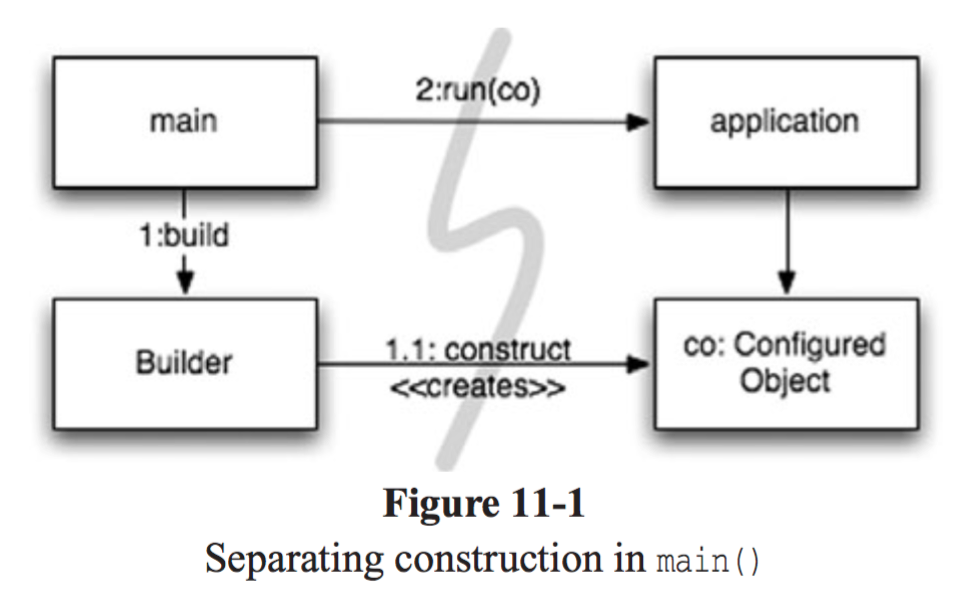
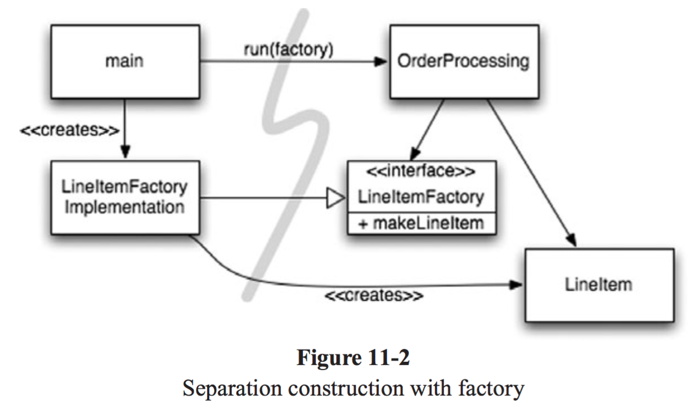

# Chapter 11 시스템

---

## 도시를 세운다면?

도시는 수도 관리 팀, 전력 관리 팀, 교통 관리 팀 등 각 분야를 관리하는 팀으로 구성되어 잘 돌아간다.

→ 적절한 **추상화와 모듈화**로 잘 돌아간다.

소프트웨어 팀도 도시처럼 구성해야 한다.

---

## 시스템 제작과 시스템 사용을 분리하라

제작과 사용은 아주 다르다.

→ 호텔을 짓는 사람과 호텔을 운영하는 사람은 다르다.

**소프트웨어 시스템은 준비 과정(객체를 생성하고 의존성을 연결)과 런타임 로직을 분리해야 한다.**

시작 단계는 모든 어플리케이션이 풀어야 할 **관심사**이다.

**관심사 분리는 가장 중요한 설계 기법이다.**

아래의 코드는 적절하게 관심사를 분리하지 않은 코드의 예시이다.

```java
public Service getService(){
		if (service == null){
				service = new MyServiceImpl();
		}
		return service;
}
```

이 코드는 Lazy Initialization 이라는 기법이다. 불필요한 부하가 걸리지 않는 장점과 null을 반환하지 않는 장점이 있다.

하지만 이 메서드는 MyServiceImpl과 생성자 인수에 의존하는 문제가 있다.

→ 런타임 로직에서 MyServiceImpl 객체를 사용하지 않더라도 의존성을 해결하지 않으면 컴파일이 안 된다.

→ 테스트를 할 때도 MyServiceImpl이 무거운 객체라면 적절한 테스트 객체를 만들어 넣어줘야 한다. 또한 모든 실행 경로도 테스트 해야 한다. 이는 SRP을 위반하게 된다.

→ 그리고 MyServiceImpl이 모든 상황에 적합한 객체인지도 모른다.

이런 초기화 지연 기법을 한 번 정도 사용하는 것은 큰 문제가 아니지만 여러 로직에서 사용한다면 이는 문제가 될 수 있다. → 모듈성이 저조하고 중복이 심해진다.

**설정 로직은 실행 로직과 분리해야 모듈성이 높아진다.**

### Main 분리

생성과 사용을 분리하는 한 가지 방법으로, 생성과 관련한 코드는 모두 main이나 main이 호출하는 모듈로 옮기고, 나머지 시스템은 모든 객체가 생성되었고 모두 의존성이 연결되었다고 가정한다.



main 함수에서 시스템에 필요한 객체를 생성한 후 이를 어플리케이션에 넘긴다. 어플리케이션은 그저 객체를 사용한다. → 어플리케이션은 main이나 객체가 생성되는 과정을 전혀 모른다.

### 팩토리

때로는 객체가 생성되는 시점을 어플리케이션이 결정할 필요도 생긴다.



주문처리 시스템에서 어플리케이션은 LineItem 인스턴서를 생성해 Order에 추가한다.

→ 추상 팩토리 패턴 사용

LineItem을 생성하는 시점은 어플리케이션이 결정하지만 LineItem을 생성하는 코드는 어플리케이션이 모른다.

여기서도 의존성이 main에서 OrderProcessing으로 향한다. → OrderProcessing은 LineItem이 생성되는 구체적인 방법을 모른다.

### 의존성 주입

스프링에서 사용하는 방법이다.

사용과 제작을 분리하는 강력한 메커니즘이다.

IOC 기법을 의존성 관리에 적용한 메커니즘이다. → 제어의 역전에서는 한 객체가 맡은 보조 책임을 새로운 객체에게 전적으로 넘긴다. 새로운 객체는 넘겨받은 책임만 맡아 SRP를 지키게 된다.

즉, 객체는 의존성 자체를 인스턴스로 만드는 책임은 지지 않는다. 대신에 이런 책임을 다른 ‘전담’ 메커니즘에 넘겨야 한다. → 제어를 역전한다. 책임질 메커니즘으로 main 루틴이나 특수 **컨테이너**를 사용

진정한 의존성 주입은 클래스가 의존성을 해결하려 시도하지 않는다.

→ 의존성을 주입하는 방법으로 setter 또는 생성자를 제공한다.

DI 컨테이너는 필요한 객체 인스턴스를 만든 후 생성자 인수나 설정자 메서드를 사용해 의존성을 설정한다.

실제로 생성되는 객체 유형은 설정 파일에서 지정하거나 특수 생성 모듈에서 코드로 명시한다.

---

## 확장

처음부터 올바르게 시스템을 만들 수 있다는 믿음은 미신이다.

우리는 오늘 주어진 사용자 스토리에 맞춰 시스템을 구현해야 한다. 내일은 내일 스토리에 맞춰 시스템을 조정하고 확장하면 된다. → 반복적이고 점진적인 애자일 방식의 핵심이다.

TDD와 리팩토링으로 얻어지는 깨끗한 코드는 코드 수준에서 시스템을 조정하고 확장하기 쉽게 만든다.

소프트웨어 시스템도 관심사를 적절하게 분리해 관리 한다면 점진적으로 발전할 수 있다.

EJB2 아키텍처는 관심사를 적절하게 분리하지 못해 유기적인 성장이 어렵다. 아래의 코드를 보자

```java
public interface BankLocal extends java.ejb.EJBLocalObject {
    String getStreetAddr1() throws EJBException;
    String getStreetAddr2() throws EJBException;
    String getCity() throws EJBException;
    String getState() throws EJBException;
    String getZipCode() throws EJBException;
    void setStreetAddr1(String street1) throws EJBException;
    void setStreetAddr2(String street2) throws EJBException;
    void setCity(String city) throws EJBException;
    void setState(String state) throws EJBException;
    void setZipCode(String zip) throws EJBException;
    Collection getAccounts() throws EJBException;
    void setAccounts(Collection accounts) throws EJBException;
    void addAccount(AccountDTO accountDTO) throws EJBException;
}
```

```java
public abstract class Bank implements javax.ejb.EntityBean {
    // 비즈니스 로직
    public abstract String getStreetAddr1();
    public abstract String getStreetAddr2();
    public abstract String getCity();
    public abstract String getState();
    public abstract String getZipCode();
    public abstract void setStreetAddr1(String street1);
    public abstract void setStreetAddr2(String street2);
    public abstract void setCity(String city);
    public abstract void setState(String state);
    public abstract void setZipCode(String zip);
    public abstract Collection getAccounts();
    public abstract void setAccounts(Collection accounts);
    
    public void addAccount(AccountDTO accountDTO) {
        InitialContext context = new InitialContext();
        AccountHomeLocal accountHome = context.lookup("AccountHomeLocal");
        AccountLocal account = accountHome.create(accountDTO);
        Collection accounts = getAccounts();
        accounts.add(account);
    }
    
    // EJB 컨테이너 로직
    public abstract void setId(Integer id);
    public abstract Integer getId();
    public Integer ejbCreate(Integer id) { ... }
    public void ejbPostCreate(Integer id) { ... }
    
    // 나머지도 구현해야 하지만 일반적으로 비어있다.
    public void setEntityContext(EntityContext ctx) {}
    public void unsetEntityContext() {}
    public void ejbActivate() {}
    public void ejbPassivate() {}
    public void ejbLoad() {}
    public void ejbStore() {}
    public void ejbRemove() {}
}
```

비즈니스 로직이 EJB2 컨테이너에 강하게 결합된다.

→ 클래스를 생성할 때 컨테이너에서 파생해야 하며 컨테이너가 요구하는 다양한 생명주기 메서드도 제공해야 한다.

비즈니스 로직과 컨테이너가 강하게 결합되어 독자적인 단위 테스트가 어렵다.

→ 객체 지향 프로그래밍이라는 개념조차 뿌리가 흔들린다.

→ 상속도 불가능하고 쓸모없는 DTO도 들어가 있다.

### 횡단(cross-cutting) 관심사

횡단 관심사: 어플리케이션 전반에 영향을 미치는 관심사

EJB2 아키텍처는 일부 영역에서 관심사를 거의 완벽하게 분리한다.

→ 트랜잭션, 보안, 영속적인 동작은 배치 기술자에서 정의

EJB2의 이러한 방식은 AOP을 예견했다고 볼 수 있다.

AOP는 횡단 관심사에 대처해 모듈성을 확보하는 일반적인 방법론이다.

AOP에서 관점이라는 모듈 구성 개념은 특정 관심사를 지원하려면 시스템에서 특정 지점들이 동작하는 방식을 일관성 있게 바꿔야 한다고 명시

아래의 3가지 횡단 관심사를 처리하는 방법을 알아보자

---

## 자바 프록시

자바 프록시는 단순한 상황에 적합 → 객체나 클래스에서 메서드 호출의 감싸는 경우

동적 프록시의 경우 인터페이스만 지원

→ 구체 클래스에 프록시를 적용하려면 CGLIB와 같은 바이트 코드 처리 라이브러리 필요

해당 기술을 직접 사용하면 코드가 상당히 많고 복잡하다는 단점이 있다.

→ 깨끗한 코드를 작성하기 어렵다.

---

## 순수 자바 AOP 프레임워크

스프링 AOP와 같은 프레임워크를 말한다.

프록시 코드는 대부분 중복이 많다. → 프레임워크가 자동화가 가능함

스프링은 비즈니스 로직을 POJO(순수 자바 코드)로 구현 → 테스트가 쉽고 간단하여 요구사항에 맞춰 올바르게 구현이 가능하다.

그 다음 개발자가 설정 파일, API 등을 사용해 필수적인 어플리케이션 기반 구조 구현

그러면 프레임워크가 사용자가 모르게 프록시 또는 CGLIB 등으로 횡단 관심사에 맞춰서 구현해준다.

이러한 방법으로 어플리케이션 코드를 사실상 스프링에 독립적이게 만들 수 있다.

→ EJB2의 강한 결합이라는 문제가 사라짐

---

## AspectJ 관점

관심사를 관점으로 분리하는 가장 강력한 도구이다.

언어 차원에서 관점을 모듈화 구성으로 지원하는 자바 언어 확장이다.

80~90% 정도는 스프링 AOP가 제공하는 방법으로 충분하지만 AspectJ는 더 강력한 수준으로 관심사를 분리해준다.

다만 새로운 문법과 사용법을 익혀야 하는 단점이 존재 → 어노테이션 기반의 AspectJ로 어느정도 해결

---

## 테스트 주도 시스템 아키텍처 구축

**코드 수준에서 아키텍처 관심사를 분리할 수 있다면 테스트 주도 아키텍처 구축이 가능해진다.**

→ 그때그때 새로운 기술을 채택해 단순한 아키텍처를 복잡한 아키텍처로 키울 수 있다.

→ 단순하면서도 멋지게 분리된 아키텍처로 소프트웨어 프로젝트를 진행해 결과물을 만들고 기반 구조를 추가해 확장을 해도 된다는 의미이다.

단, 아무 방향 없이 프로젝트에 뛰어들면 안된다. 일반적인 범위, 목표, 일정은 물론이고 결과로 나올 시스템의 구조도 고려해야 한다.

> 최선의 시스템 구조는 POJO 객체로 구현되는 모듈화된 관심사 영역으로 구성된다.
서로 다른 영억은 해당 영역 코드에 최소한의 영향을 미치는 관점이나 유사한 도구를 사용해 통합한다.
>

---

## 의사 결정을 최적화하라

모듈을 나누고 관심사를 분리하면 지엽적인 관리와 결정이 가능해진다.

→ 가장 적합한 사람에게 책임을 맡기면 가장 좋다.

가능한 마지막 순간까지 결정을 미루는 방법이 최선이다.

→ 최대한 정보를 모아 최선의 결정을 내리기 위함

> 관심사를 모듈로 분리한 POJO 시스템은 기민함을 제공
→ 최신 정보에 기반해 최선의 시점에서 최적의 결정을 내리기가 쉬워진다. + 결정의 복잡성 줄어듦
>

---

## 명백한 가치가 있을 때 표준을 현명하게 사용하라

표준을 사용하고자 할 때 정말로 표준이 가치가 있는 지 확인하고 사용하는 게 좋다.

우선 순위는 항상 고객 가치이다.

---

## 시스템은 도메인 특화 언어가 필요하다.

DSL은 간단한 스크립트 언어나 표준 언어로 구현한 API를 가리킨다.

DSL로 짠 코드는 구조적인 산문처럼 읽힌다.

좋은 DSL은 도메인 개념과 구현한 코드 사이의 의사소통 간극을 줄여준다.

DSL은 추상화 수준을 코드 관용구나 디자인 패턴 이상으로 끌어 올려준다.

→ 개발자가 적절한 추상화 수준에서 코드 의도를 표현할 수 있다.

---

## 결론

시스템 역시 코드와 마찬가지로 깨끗해야 한다.

더러운 아키텍처는 도메인 로직은 흐리게 하고 기민성을 떨어뜨린다.

→ 결국엔 제품 품질이 떨어지는 결과를 맞이한다.

→ 버그 발생, 스토리 구현 어려움 등 생산성이 떨어짐

**모든 추상화 단계에서 의도를 명확하게 표현해야 한다.**

**POJO를 작성하고 관점을 사용해 구현 관심사를 분리해야 한다.**

가장 단순한 수단을 사용해야 한다!!!